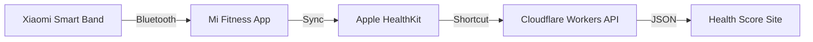

# Health Score Dashboard

毎日の健康状態をスコア化して可視化するダッシュボードです。
Xiaomi Smart Band 6などのウェアラブルデバイスで計測したデータを、Appleヘルスケア経由で取得し表示します。

## 🚀 機能

- **総合スコア**: 睡眠、歩数、カロリー、心拍数から独自のアルゴリズムで100点満点のスコアを算出
- **データ可視化**: 各メトリクスをカード形式で表示し、個別の評価スコアも確認可能
- **自動連携**: iPhoneショートカットを使って、Appleヘルスケアのデータをワンタップで同期
- **レスポンシブ**: スマホファーストなデザイン

## 🛠 アーキテクチャ



- **Frontend**: React, TypeScript, Vite, Tailwind CSS
- **Backend**: Cloudflare Workers (Hono-like simple API), KV Storage
- **Hosting**: GitHub Pages

## 📱 セットアップ

### 1. サイトのデプロイ
GitHub Actionsにより、`main` ブランチへのプッシュで自動的にGitHub Pagesにデプロイされます。

### 2. APIのデプロイ (Cloudflare Workers)
`cloudflare-worker` ディレクトリ内で:
```bash
npm install
npm run deploy
```

### 3. iPhoneショートカットの作成
Appleヘルスケアからデータを取得し、APIに送信するショートカットを作成します。
詳細は `apple_healthkit_setup.md` を参照してください。

## 📝 使い方

1. 毎朝、iPhoneのショートカット「ヘルススコア更新」を実行
2. 通知が表示されたら、サイトを開く
3. 前日のデータに基づいたスコアが表示されます

## 開発

```bash
# 依存関係のインストール
npm install

# 開発サーバーの起動
npm run dev

# ビルド
npm run build
```
